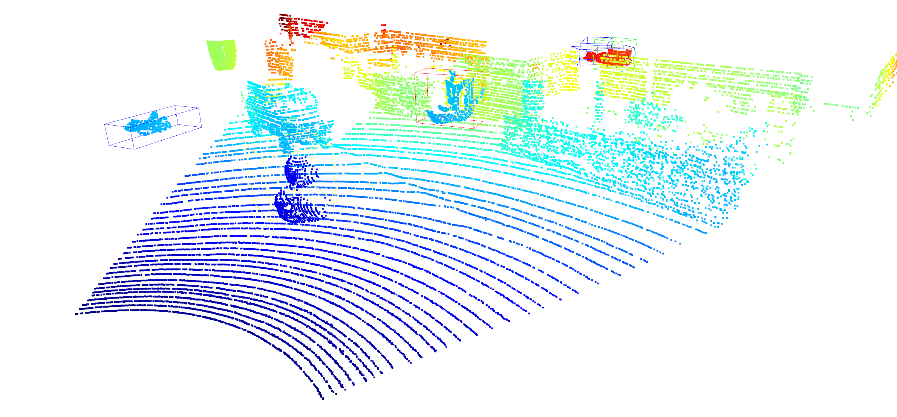

# Adaptation of VoteNet for Outdoor 3D Object Detection Using Synthetic Datasets

## Introduction

This repository presents the culmination of my B.Sc. final project in mechanical engineering, focusing on adapting the VoteNet framework for 3D object detection in outdoor environments. Originally designed for indoor applications, VoteNet required extensive modifications to handle the complexities of outdoor scenes, presenting both technical and conceptual challenges.

Outdoor object detection poses unique difficulties compared to controlled indoor conditions, including varying lighting, weather, and environmental clutter. To overcome these, I developed a pipeline for generating synthetic datasets using simulated LiDAR scans, leveraging a Z-depth buffering technique. This method allowed for realistic point cloud generation by simulating the visibility of objects in 3D scenes, accounting for occlusions and environmental variability.

A key challenge encountered during the project was adapting VoteNet's loss function and objectness classification module. Initial tests revealed a common issue where the model would classify nearly all points as background, neglecting object detection. This bias, widely reported by others using custom datasets, was rooted in an imbalance between object and background point distributions. By recalibrating the loss function, adjusting class weights, and modifying training parameters, I resolved this issue, enabling the model to learn meaningful object classifications.

Furthermore, adapting the VoteNet framework to work with outdoor data required significant updates to its architecture and training scripts. These changes included integrating the synthetic dataset, recalibrating thresholds, and introducing mechanisms to handle outdoor scene variability.

This project demonstrates the potential of synthetic datasets for advancing 3D object detection in real-world applications. The resulting pipeline bridges the gap between VoteNet's original indoor focus and the demands of dynamic outdoor environments, paving the way for future advancements in autonomous systems, robotics, and augmented reality.



---

## Prerequisites

### Required Libraries
To set up the repository, install the following dependencies using `pip`:

```bash
pip install numpy open3d matplotlib pyyaml trimesh scipy Pillow torch torchvision pygame numpy-stl PyOpenGL
```

Ensure your Python environment has access to CUDA (if using GPU) and that the `torch` version matches your hardware capabilities.

### KITTI Dataset

1. **Register on the KITTI website**:  
   Go to [KITTI Dataset](https://www.cvlibs.net/datasets/kitti/raw_data.php) and create an account.

2. **Download KITTI Files**:  
   After registration, download the **synchronized** or **unsynchronized** data from the KITTI raw dataset. The number of recordings to download depends on your requirements.

3. **Organize KITTI Files**:  
   Arrange the downloaded files in a structure compatible with the repository. An example folder structure is provided in the repository under `kitti_files`.

4. **Set up paths in `Batch_DataSet_Create.py`**:  
   Update the `kitti_dir` variable in `Batch_DataSet_Create.py` to point to the directory where your KITTI files are located. This script uses KITTI files to generate a synthetic dataset.

---

## Path Setup for Generated Dataset

The dataset generated by `Batch_DataSet_Create.py` will be stored in the `ProcessedDataset` directory. Other scripts in the repository rely on this generated dataset and require paths to be updated:

1. **`data_config.py`**:  
   Update the `self.config_file_path` variable to point to the `data_config.yaml` file generated in the `ProcessedDataset` directory.

2. **`detection_dataset.py`**:  
   Update the `dataset_dir` variable to point to the `ProcessedDataset` directory.

3. **`train.py`**:  
   Ensure that paths for the dataset configuration and checkpoints match the generated dataset.

Failure to update these paths will result in errors during training, evaluation, or inference.

---

## Generate Dataset

The script `Batch_DataSet_Create.py` automates the dataset creation process by:
- Splitting KITTI point clouds into segments.
- Placing custom objects randomly in the scenes.
- Generating labels and ground truth votes.

To generate a dataset:
1. Place your object models in the `models/PC` directory as `.ply` files.
2. Run the script:
   ```bash
   python Batch_DataSet_Create.py
   ```
3. This will generate the dataset in the `ProcessedDataset` directory, divided into `train`, `val`, and `test` splits.

### Included Sample Dataset

This repository includes a sample dataset in the `ProcessedDataset-sample` directory, containing:
- 100 scenes each for `train`, `val`, and `test` splits.

This sample can be used to test the pipeline without generating a new dataset.


---

## Train the Model

1. Run the training script:
   ```bash
   python train.py
   ```
2. Checkpoints and logs will be saved in the `votenet-main/log_150_epochs` directory.

---

## Evaluate the Model

1. Update `evaluate.py` with paths to your dataset and checkpoint files.
2. Run the script:
   ```bash
   python evaluate.py
   ```

---

## Inference

1. Update `Inference.py` with the path to your test scene and trained weights.
2. Run the script:
   ```bash
   python Inference.py
   ```

---

## STL Model Processing Pipeline

To use custom STL models, the repository provides the following scripts for preprocessing:

1. **Translate STL Origin** (`move_stl_origin.py`):  
   Aligns the STL model origin to the desired position for proper placement in scenes.
   ```bash
   python move_stl_origin.py
   ```

2. **Scale STL Models** (`Scale_STL.py`):  
   Scales STL models to a specified factor for compatibility with the scene dimensions.
   ```bash
   python Scale_STL.py
   ```

3. **Measure Model Dimensions** (`size_model.py`):  
   Outputs the dimensions (length, width, height) of models in the `models/PC` directory.
   ```bash
   python size_model.py
   ```

4. **Convert STL to Point Clouds** (`ConvertFromSTL2PC.py`):  
   Converts STL models into `.ply` point cloud files.
   ```bash
   python ConvertFromSTL2PC.py
   ```

---

## Acknowledgments

This project is based on:
- **VoteNet**:
  ```bibtex
  @article{qi2019votenet,
    title={VoteNet: A deep learning model for 3D object detection in point clouds},
    author={Qi, Charles R and others},
    journal={NeurIPS},
    year={2019}
  }
  ```
- **KITTI Dataset**:
  ```bibtex
  @article{geiger2013vision,
    title={Vision meets robotics: The KITTI dataset},
    author={Geiger, Andreas and others},
    journal={IJRR},
    year={2013}
  }
  ```

---

## Reference to This Work

If you use this repository or find it helpful, please cite the following:

```bibtex
@article{weisberg2024adaptation,
  title={Adaptation of VoteNet for Outdoor 3D Object Detection Using Synthetic Datasets},
  author={Weisberg, Ran},
  journal={Unpublished},
  year={2024}
}
```
